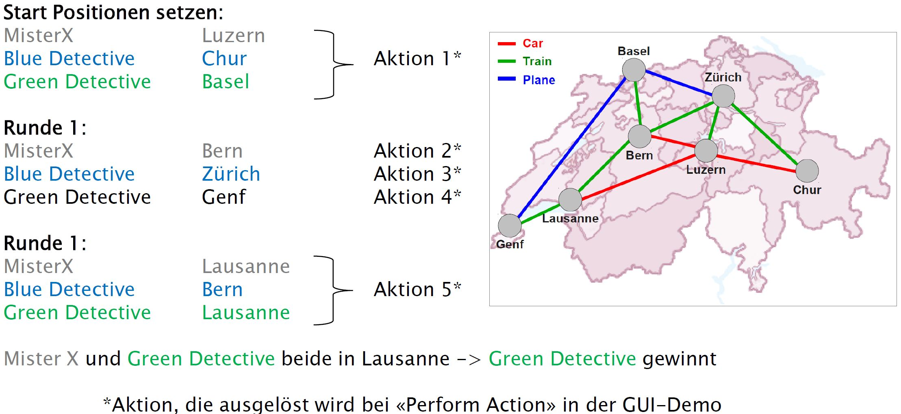
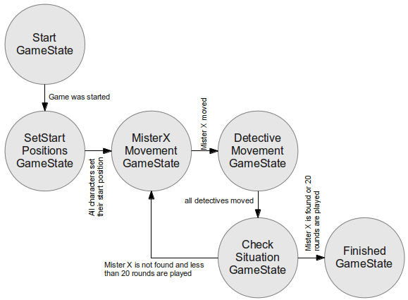

# MisterX Design Patterns

Im Rahmen meiner Bachelor-Vertiefung habe ich die gelernten Design Patterns am Beispiel unseres SOPRA-Projektes MisterX angewendet.

## Demo

Die Demo beinhaltet folgenden kurzen Beispiel-Spieldurchlauf:

Die Klasse `ShellDemo` startet die Demo in einer Shell. 
Die Spiel-Informationen werden nach jeder Runde auf der Shell ausgegeben. 
Alternativ kann mit der Klasse `GuiDemo` ein sehr minimales grafisches Benutzerinterface gestartet werden, 
dass die Spiel-Informationen zeigt und als Beispiel-Implementation des MVC-Musters dient. 
Im Gengensatz zur `ShellDemo` läuft die `GuiDemo` nicht an einem Stück durch: 
Durch Drücken des *Perform Action* Buttons im GUI wird eine Aktion ausgeführt.

