# Umgesetzte Patterns

## Strategy
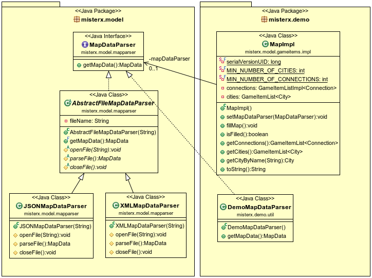

## Observer
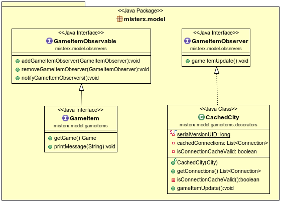

## Decorator
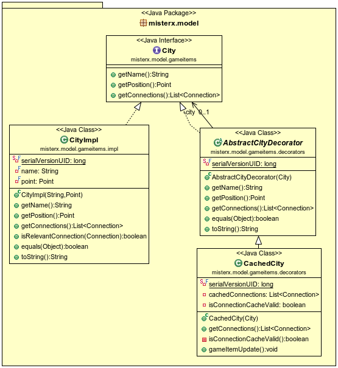

## Factory
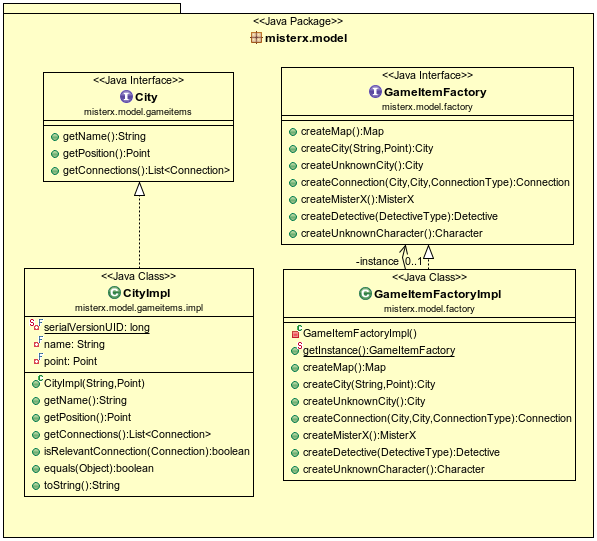

## Singleton
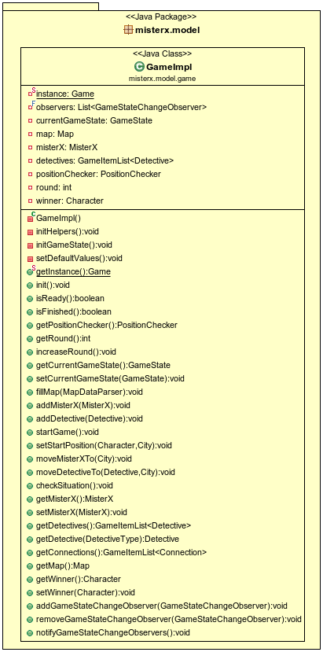

## Command
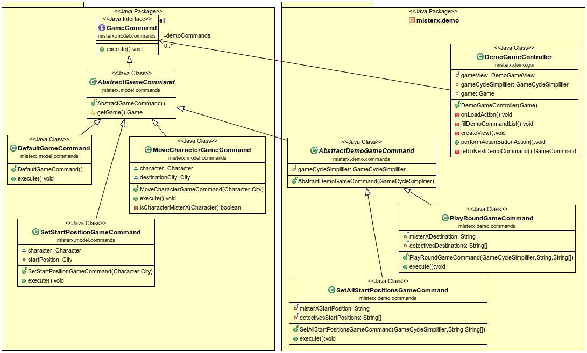

## Adapter
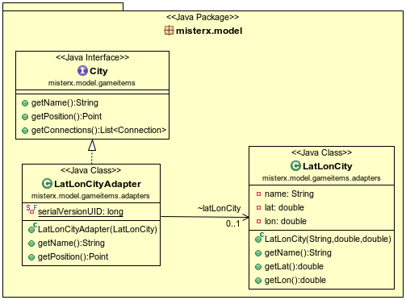

## Facade
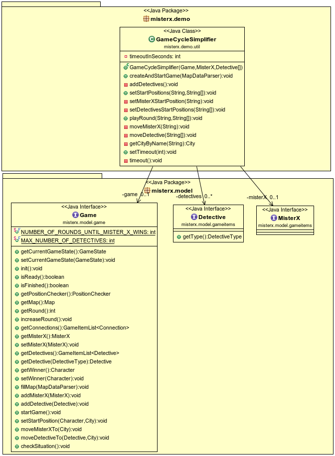

## Template Method
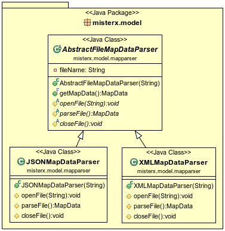

## Iterator
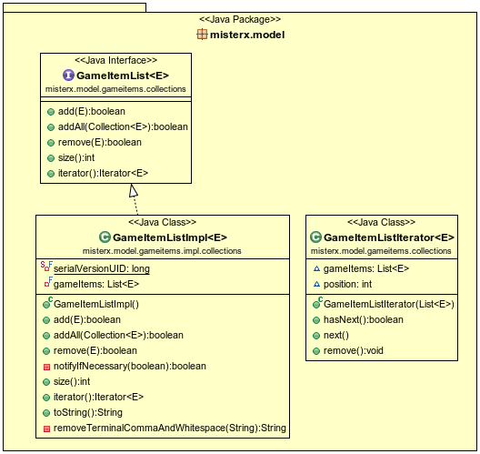

## State
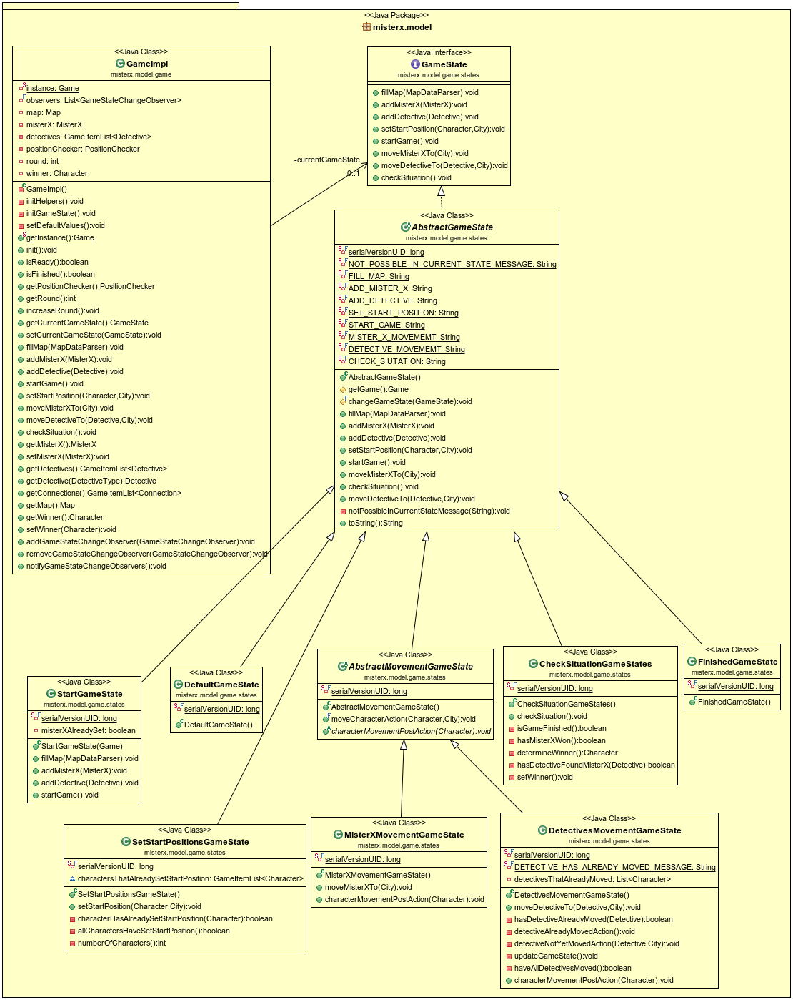

## Model-View-Controller

